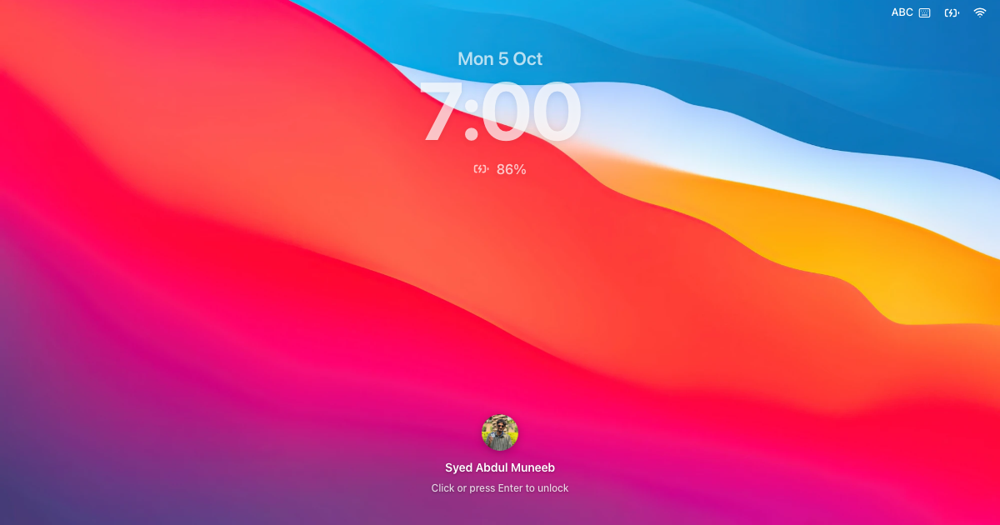

# MuneebOS — Syed Abdul Muneeb's Portfolio

An interactive portfolio that looks and behaves like a Mac. Visitors unlock a
lock screen, then explore my work through a Dock, a menu bar, Spotlight,
Control Center, and windows they can drag, zoom, and minimize.

**Live:** [portfolio-muneeb.vercel.app](https://portfolio-muneeb.vercel.app)



## What's inside

### Desktop, tablet, and phone

- **Lock screen** — clock, date, battery status; click or press Enter to unlock.
- **Menu bar** — Apple menu (About, System Settings, Lock Screen, Restart,
  Shut Down), the active app's name, File / Edit / View / Go / Window / Help.
- **Status items** that work like macOS:
  - **Battery** — real battery level and power source (Chromium browsers).
  - **Wi-Fi** — on/off switch and real online status; Safari shows an
    offline page when Wi-Fi is off.
  - **Spotlight** (⌘K / Ctrl+K) — search and launch any app.
  - **Control Center** (macOS Tahoe style) — Wi-Fi, Bluetooth, AirDrop,
    Now Playing (plays real songs), Stage Manager, Screen Mirroring,
    Dark Mode, Screenshot (saves a PNG of the page), Focus, Display
    brightness, Sound volume, Edit Controls.
  - **Clock** — Notification Center with notifications and a calendar.
- **Dock** — magnifies on hover, bounces while an app launches, shows running apps.
- **Desktop files** — About Me, Projects, Resume.pdf, Contact; draggable,
  snapping to a grid. Drag on the empty desktop to select several, or
  Shift-click to add to the selection. Right-click the desktop for New Folder,
  Change Wallpaper, Clean Up and Spotlight; right-click a folder to Rename it,
  Move it to the Trash (⌘⌫) or Move it to another desktop. Trash has Put Back
  and Empty Trash.
- **Windows** — traffic-light buttons, drag, resize, animated zoom, and
  minimize into the app's Dock icon. Drag a window to the left or right
  screen edge to tile it, or to the top to fill the screen (macOS Sequoia
  tiling); drag it away to get its old size back.
- **Mission Control** (two-finger swipe up on the empty desktop, Ctrl+↑, F3,
  or Window → Mission Control) — every window on the current desktop side by
  side; click one to bring it forward. Swipe down to leave.
- **Desktops (Spaces)** — Mission Control's top strip shows each desktop;
  **+** adds one (up to six), **×** removes one (its windows and files move
  to the neighbour), click to switch. Each desktop has its own windows and
  files. Switch with a two-finger swipe left/right on the desktop, Ctrl+←/→
  or Ctrl+1…6. Drag a window in Mission Control onto another desktop (or
  onto + for a new one); drag a file to the screen edge and hold to carry it
  across. Window → Move to Desktop N also works. Browsers never see three-
  or four-finger gestures, so MuneebOS uses two fingers on the desktop;
  swipes over a window still scroll it.
- **Notification banners** — for sent messages, feedback, screenshots, and a
  first-visit welcome. Focus mode silences them.
- **Guided tour** available from Help → Take the Tour.

### Apps

| App | What it shows |
|---|---|
| About Me | Experience, skills, awards |
| Projects | Shipped work and research: Arrwin, AiResumate, GetMarks, Hypogen, a paper on checkpointed LLM agents, E-Cell |
| Resume | PDF viewer with download (`public/syedabdulmuneebresume.pdf`) |
| Contact | Message form (saved to Supabase), email, phone, socials |
| GitHub | Live public activity and repositories |
| App Store | My projects, jobs and skills presented like the Mac App Store: Discover, Arcade, Create, Work, Play, Develop, Categories, Updates, Account, product pages and search |
| Terminal | `help`, `about`, `projects`, `open <app>`, `install <app>`, `uninstall <app>`, `store`, … |
| Safari | Links to products I've worked on |
| Finder | Folders, music, and the games you've installed |
| System Settings | Appearance, wallpaper, display, sound, accessibility, keyboard shortcuts |
| Feedback | Reviews and bug reports (saved to Supabase) |
| Trash, Activity Monitor, Calculator, Music | Small desktop utilities |

#### App Store apps

Fourteen apps start uninstalled. **Get** one in the App Store (or run
`install <name>` in Terminal) and it joins Finder › Applications,
Spotlight, the Dock while open, and the phone Home Screen. Remove it again
from its product page or Account › My Apps.

- **Games:** 2048, Tic-Tac-Toe (minimax computer), Memory, Breakout, Word
  Guess, Simon, Snake, Minesweeper
- **Tools:** Typing Test, Pomodoro, Sketch, Piano, Color Lab, JSON Formatter

Product pages use real captures of the live sites where they load
(GetMarks), drawn screens where they don't, and live, scaled-down
renders of the apps themselves. Share links (`/?app=<id>`) open a product
page after unlock. Gift codes `ARCADE` and `HIREME` install sets of apps.

### Responsive behavior

Desktop and tablet use the macOS workspace. Below 700px, the portfolio switches
to an iPhone-inspired home screen with app folders, Search, a four-app Dock,
Control Center, and a swipeable lock screen. Apps open full screen with a Home
control; Finder, Projects, and Settings use horizontal categories on phones.

### Keyboard shortcuts

Use Command on macOS or Ctrl on Windows/Linux: K opens Spotlight, comma opens
Settings, M minimizes, W closes, and backtick cycles visible windows. Finder
supports Command+O/Return to open, Command+Up for Home, Command+1/2 for views,
and Command+[/] for navigation. Escape dismisses menus and Spotlight.
Command+Space is supported when the operating system passes it to the page.
Browser and OS reserved shortcuts may take precedence; menu actions remain available.

Appearance, wallpaper, reduced motion, sound, notes, and window state are
saved locally. Music and Control Center share one audio player.

## Tech stack

- [Next.js 15](https://nextjs.org) (App Router) + React 18 + TypeScript
- [Tailwind CSS 4](https://tailwindcss.com)
- [Zustand](https://zustand-demo.pmnd.rs) for window and settings state
- [Framer Motion](https://www.framer.com/motion/) for animation
- [Supabase](https://supabase.com) for the contact and feedback forms
- [lucide-react](https://lucide.dev) icons

## Getting started

Requires Node.js 18.18 or newer.

```bash
npm install
npm run dev
```

Open [http://localhost:3000](http://localhost:3000) at any screen size.

Other scripts:

```bash
npm run build   # production build
npm run start   # serve the production build
npm run lint    # lint
```

## Project structure

```
app/
  layout.tsx            Metadata, fonts, analytics
  page.tsx              Lock screen → responsive desktop
  globals.css           Global styles and the .font-mac typography class
components/
  desktop.tsx           Composes the desktop: menu bar, files, windows, Dock
  window.tsx            Window chrome (traffic lights, drag, resize, zoom)
  desktop-icon.tsx      Desktop files (top-right anchored, grid snapping)
  mac/                  macOS shell: menu bar, Dock, Spotlight, lock and boot
                        screens, Control Center, Notification Center, tour
  windows/              The apps (About, Projects, Contact, Terminal, …)
lib/
  app-registry.ts       Every app: id, title, component, size, Dock order
  app-icons.tsx         App icons (Big Sur-style PNGs and drawn icons)
  launch-app.ts         launchApp(id) — the one way to open an app
  window-manager.ts     Zustand store for windows and desktop state
  system-controls.ts    Control Center settings (Wi-Fi, brightness, …)
  desktop-grid.ts       Grid used by desktop files and drag-and-drop
  now-playing.ts        Shared audio player for Control Center
public/
  icons/mac/            App icon PNGs
  wallpapers/           Default wallpaper
docs/
  supabase.md           Database setup for the forms
  superpowers/          Design spec and implementation plan for the macOS shell
```

## Adding an app

1. Build the window content as a component in `components/windows/`.
2. Register it in `windowComponents` in `components/desktop.tsx`.
3. Add an entry to `APP_REGISTRY` in `lib/app-registry.ts` (id, title,
   component name, default size, Spotlight aliases).
4. Optionally add its id to `DOCK_APP_IDS`, give it an icon in
   `lib/app-icons.tsx`, or set `showOnDesktop` to place it on the desktop.

It is then available from the Dock, Spotlight, the Terminal (`open <alias>`),
and anywhere else that calls `launchApp(id)`.

## Contact and feedback forms

The Contact and Feedback apps write to Supabase. Table definitions and
row-level security policies are in [docs/supabase.md](docs/supabase.md).
The client is configured in `lib/supabase-client.ts`.

## Deployment

Hosted on [Vercel](https://vercel.com) at
[portfolio-muneeb.vercel.app](https://portfolio-muneeb.vercel.app). The site
builds with `npm run build` and needs no environment variables.

## Browser notes

- Battery status uses the Battery Status API (Chrome, Edge); other browsers
  hide it.
- Screenshot uses screen capture (`getDisplayMedia`); the browser asks which
  tab to share each time.
- Wi-Fi, Bluetooth, and brightness controls affect the site only — a web
  page can't change system settings.

## Credits

- Big Sur-style app icons (Finder, Safari, Terminal, Mail, System Settings,
  Calculator, Notes) from [PuruVJ/macos-web](https://github.com/PuruVJ/macos-web).
- System Settings sidebar icons from the
  [Alfred System Settings workflow](https://github.com/alfredapp/system-settings-workflow).
- The default wallpaper is Apple's macOS Big Sur wallpaper.
- Apple, macOS, Finder, Safari, and the Apple logo are trademarks of
  Apple Inc. This is a personal portfolio project and is not affiliated with
  or endorsed by Apple.

## Contact

**Syed Abdul Muneeb** — [LinkedIn](https://www.linkedin.com/in/syed-abdul-muneeb/)
· [GitHub](https://github.com/AbdulMuneebSyed)
